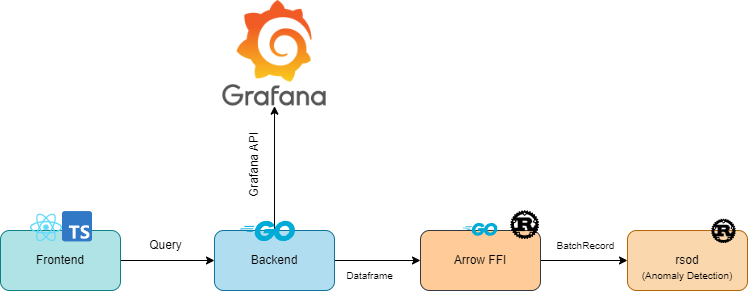
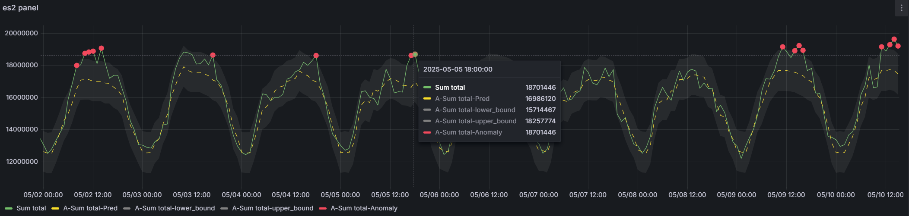

# Anomaly detection based on machine learning.

❗️❗️❗️ **POC Project**.

Grafana supports a wide range of data sources, including Prometheus, MySQL, and even Datadog. There’s a good chance you can already visualize metrics from the systems you have set up. **Alert4ML** serves as the observability layer for SRE teams, automatically detects anomalies in time-series data based on collected data, thereby reducing the effort required by fixed-threshold methods and manual identification of abnormal system behavior.

## Architecture




## Technology Stack

* Frontend: [TS](https://www.typescriptlang.org/) / [React](https://react.dev/)
* Backend: [Go](https://go.dev/) / [CGO](https://pkg.go.dev/cmd/cgo)
* Algorithm: [Rust](https://www.rust-lang.org/)
* Data Transform: [Arrow Dataframe](https://arrow.apache.org/docs/index.html)

## Getting started

You can download and install this grafana plugin using various options

* From [Grafana plugin catalog](https://grafana.com/grafana/plugins/ibumblebee-alerts4ml-datasource/)
* From [Github release page](https://github.com/IBUMBLEBEE/grafana-alert4ml-datasource/releases)
* Using grafana cli

    ```shell
    grafana-cli plugins install ibumblebee-alert4ml-datasource
    ```

## Configuration

1. Request a service account token. Home --> Administration --> Users and access --> Service accounts
2. Enter the address and token to access the Grafana API. Home --> Connections --> Data sources --> ibumblebee-alert4ml-datasource

This plugin relies on Grafana's Mixed data source mode.


### Development building and running

TODO

## Demo





## Reference

* https://grafana.com/developers/plugin-tools/
* https://grafana.com/docs/grafana-cloud/machine-learning/dynamic-alerting/forecasting/
* https://docs.victoriametrics.com/anomaly-detection/