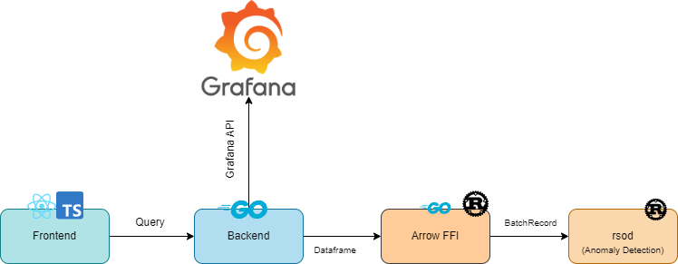
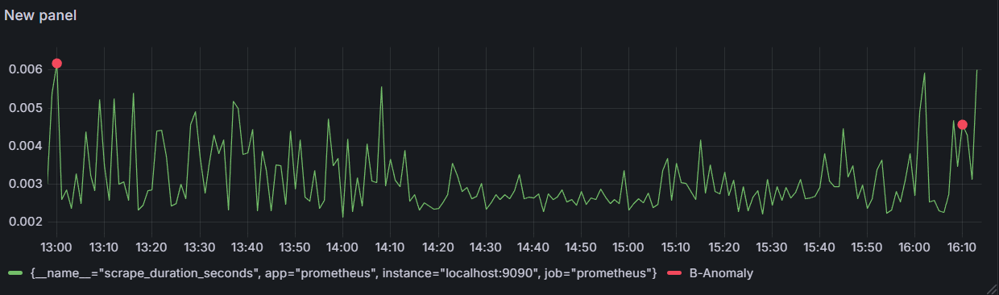
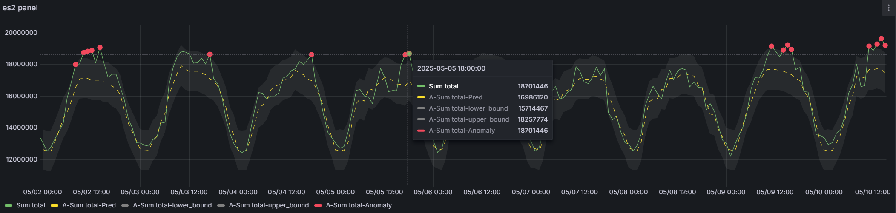

# Anomaly detection based on machine learning.

Grafana supports a wide range of data sources, including Prometheus, MySQL, and even Datadog. There’s a good chance you can already visualize metrics from the systems you have set up. **Alert4ML** serves as the observability layer for SRE teams, automatically detects anomalies in time-series data based on collected data, thereby reducing the effort required by fixed-threshold methods and manual identification of abnormal system behavior.

## Architecture



## Technology Stack

* Frontend: [TS](https://www.typescriptlang.org/) / [React](https://react.dev/)
* Backend: [Go](https://go.dev/) / [CGO](https://pkg.go.dev/cmd/cgo) / [Rust](https://www.rust-lang.org/)
* Data Transform: [Arrow Dataframe](https://arrow.apache.org/src/img/index.html)

## Algorithm

1. [extended-isolation-forest](https://github.com/nmandery/extended-isolation-forest)
2. [STL](https://github.com/ankane/stl-rust)
3. [perpetual](https://github.com/perpetual-ml/perpetual)

## Getting started

**Searching in the Grafana plugin catalog is not supported due to the following limitations:**

* Grafana plugins in general should not access any file system. [github issues](https://github.com/IBUMBLEBEE/grafana-alert4ml-datasource/issues/1)
* CGO and glibc dependencies.

~~You can download and install this grafana plugin using various options~~

* ~~From [Grafana plugin catalog](https://grafana.com/grafana/plugins/ibumblebee-alerts4ml-datasource/)~~
* ~~From [Github release page](https://github.com/IBUMBLEBEE/grafana-alert4ml-datasource/releases)~~
* ~~Using grafana cli~~

    ```shell
    grafana-cli plugins install ibumblebee-alert4ml-datasource
    ```

### Installation

**The Grafana plugin directory must be `/var/lib/grafana/plugins` because `CGO` specifies this path for searching. [Reference](https://github.com/IBUMBLEBEE/grafana-alert4ml-datasource/blob/main/pkg/rsod/rsod.go#L7).**

1. [Download from release](https://github.com/IBUMBLEBEE/grafana-alert4ml-datasource/releases)
2. Unzip file. `unzip ibumblebee-alert4ml-datasource-v0.1.21-linux-amd64.zip`

3. Move to `/var/lib/grafana/plugins/ibumblebee-alert4ml-datasource`

## Configuration

1. Request a service account token. Home --> Administration --> Users and access --> Service accounts
2. Enter the address and token to access the Grafana API. Home --> Connections --> Data sources --> ibumblebee-alert4ml-datasource

This plugin relies on Grafana's Mixed data source mode.


### Development building and running

```shell
git clone https://github.com/IBUMBLEBEE/grafana-alert4ml-datasource.git
cd grafana-alert4ml-datasource
make
```

## Demo




## Reference

* https://grafana.com/docs/grafana-cloud/machine-learning/dynamic-alerting/forecasting/
* https://docs.victoriametrics.com/anomaly-detection/
