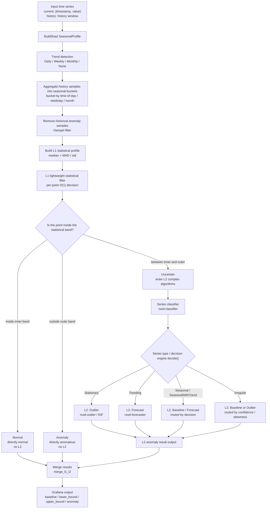
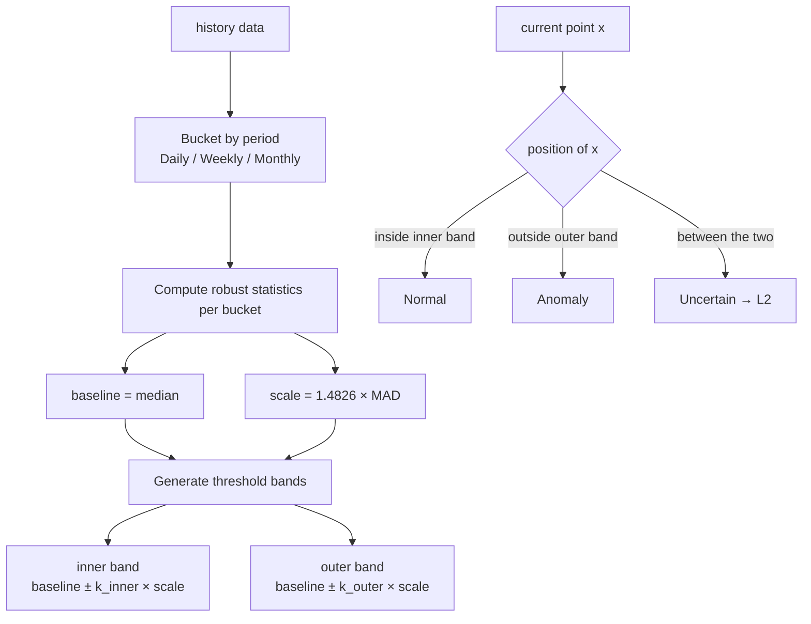
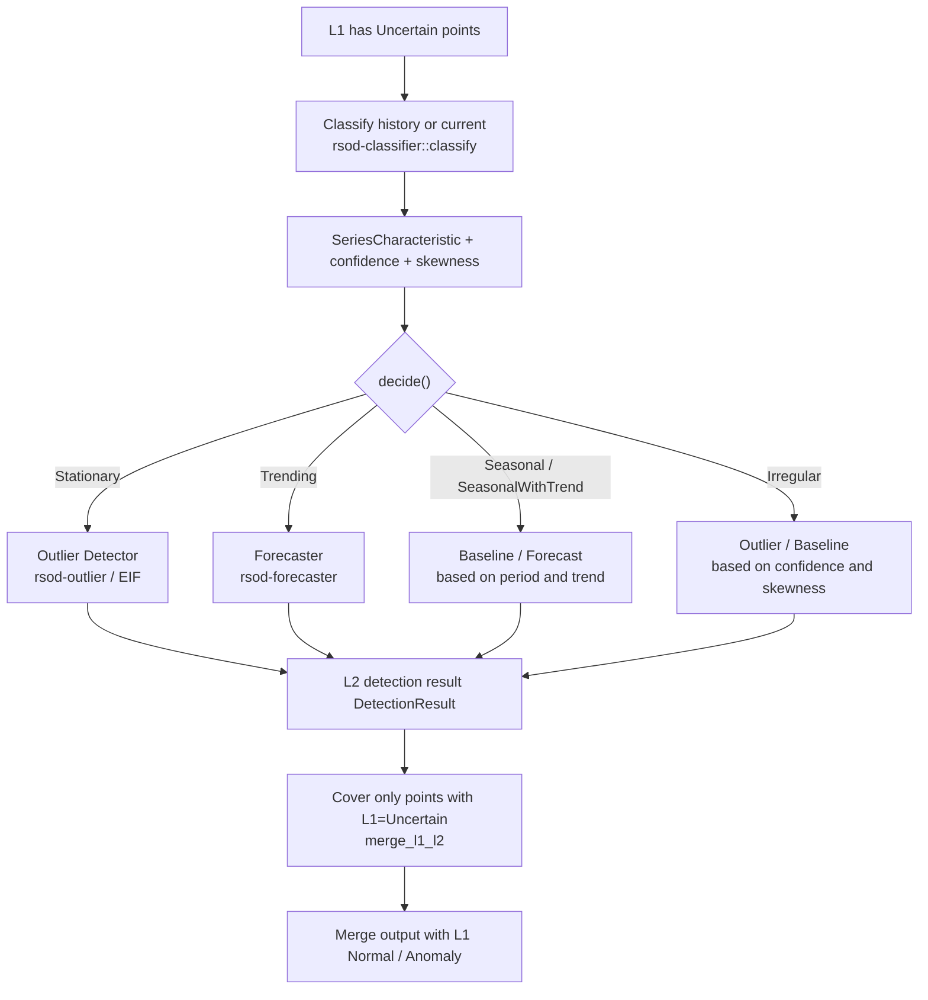
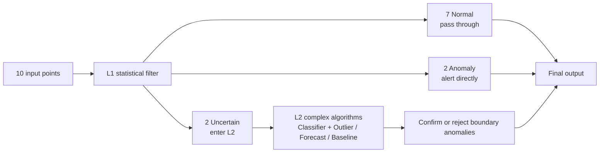

# Funnel: Funnel-Shaped Time-Series Anomaly Detection

This document describes the overall flow of `rsod-funnel` and the L1 / L2 algorithm flows, explaining the processing path of a time-series through the funnel architecture.

## 1. Design Goals

Funnel uses a layered, funnel-shaped detection:

- **L1 (statistical pre-filter)**: a lightweight, statistics-oriented algorithm that makes an O(1) decision per point for the vast majority of points, directly classifying clearly normal and clearly anomalous points.
- **L2 (complex algorithms)**: only escalates the gray-zone points (`Uncertain`) that L1 cannot decide to heavier ML algorithms (Outlier / Forecast / Baseline).

The goal is for most normal data to be filtered out in L1, with only a few uncertain points entering L2, balancing accuracy and cost.

Corresponding implementations:

- L1: [rsod/crates/rsod-funnel/src/l1.rs](../rsod/crates/rsod-funnel/src/l1.rs)
- Profile: [rsod/crates/rsod-funnel/src/profile.rs](../rsod/crates/rsod-funnel/src/profile.rs)
- Pipeline: [rsod/crates/rsod-funnel/src/pipeline.rs](../rsod/crates/rsod-funnel/src/pipeline.rs)
- L2 routing: [rsod/crates/rsod-funnel/src/l2.rs](../rsod/crates/rsod-funnel/src/l2.rs)
- Metrics: [rsod/crates/rsod-funnel/src/metrics.rs](../rsod/crates/rsod-funnel/src/metrics.rs)

## 2. Overall Flow Diagram



## 3. L1 Algorithm Flow

L1 builds a seasonal profile from history and makes an O(1) three-state decision for each current point, without retraining.



L1 three-state decision semantics ([FilterVerdict](../rsod/crates/rsod-funnel/src/l1.rs)):

| Verdict | Condition | Handling |
| --- | --- | --- |
| `Normal` | Inside the `inner band` | Directly normal, does not enter L2 |
| `Anomaly` | Outside the `outer band` | Directly anomalous, does not enter L2 |
| `Uncertain` | Between the inner and outer bands | Escalated to L2 complex algorithms |

The threshold method (MAD / IQR / ZScore) is chosen automatically from the skewness of the history data.

## 4. L2 Algorithm Flow

L2 is not a single fixed model: it first classifies the series, then routes to a concrete algorithm via the decision engine, and **only covers the points L1 judged `Uncertain`**.



Summary in one sentence:

> L1 uses the historical statistical profile to quickly cut out clearly normal and clearly anomalous points; only gray-zone `Uncertain` points trigger L2. L2 first determines the time-series type, then routes to the Outlier, Forecast, or Baseline algorithm, and finally only covers the verdicts for these gray-zone points.
>
> Note: L2 is currently disabled by default on the Grafana panel path (`enable_l2 = false`, see [rsod/crates/rsod-backend/src/pipeline.rs](../rsod/crates/rsod-backend/src/pipeline.rs)); it can be enabled explicitly on the algorithm side.

## 5. Example: A Time Series Through L1/L2

Assume the current window has 10 points:

| Point | Raw value | L1 verdict | Enters L2? | Final result |
| --- | ---: | --- | --- | --- |
| t1 | 100 | Normal | No | Normal |
| t2 | 102 | Normal | No | Normal |
| t3 | 98 | Normal | No | Normal |
| t4 | 135 | Uncertain | Yes | Decided by L2 |
| t5 | 160 | Anomaly | No | Anomaly |
| t6 | 101 | Normal | No | Normal |
| t7 | 129 | Uncertain | Yes | Decided by L2 |
| t8 | 99 | Normal | No | Normal |
| t9 | 97 | Normal | No | Normal |
| t10 | 180 | Anomaly | No | Anomaly |

The corresponding funnel split:



## 6. Measurable Funnel Effectiveness

`funnel_detect_with_metrics` returns [FunnelMetrics](../rsod/crates/rsod-funnel/src/metrics.rs) alongside detection, to quantify the funnel split:

| Metric | Semantics |
| --- | --- |
| `total_points` | Number of points in the current eval window |
| `l1_normal` / `l1_anomaly` / `l1_uncertain` | L1 three-state split counts |
| `l1_coverage_rate` | L1 direct-decision ratio `(normal + anomaly) / total` |
| `l2_escalation_rate` | Ratio escalated to L2 `uncertain / total` |
| `l2_enabled` / `l2_triggered` | Whether L2 is enabled / whether it triggered this time |
| `l2_method` | The algorithm L2 actually routed to this time |
| `l1_elapsed_ms` / `l2_elapsed_ms` / `total_elapsed_ms` | Per-stage elapsed times |

The funnel goal can be stated as: keep `l1_coverage_rate` as high as possible (most points decided in L1) while keeping `l2_escalation_rate` in a low range.

## 7. Visualization and Benchmark

- Panel visualization example: [rsod/crates/rsod-funnel/examples/funnel_viz.rs](../rsod/crates/rsod-funnel/examples/funnel_viz.rs)
- Metric benchmark (including `L1_cov` / `L2_rate` / elapsed): [rsod/crates/rsod-funnel/examples/funnel_bench.rs](../rsod/crates/rsod-funnel/examples/funnel_bench.rs)

How to run:

```bash
cd rsod
cargo run --example funnel_viz -p rsod-funnel --release
cargo run --example funnel_bench -p rsod-funnel
```

Visualization output directory: `dataset/output/funnel_viz/`.
