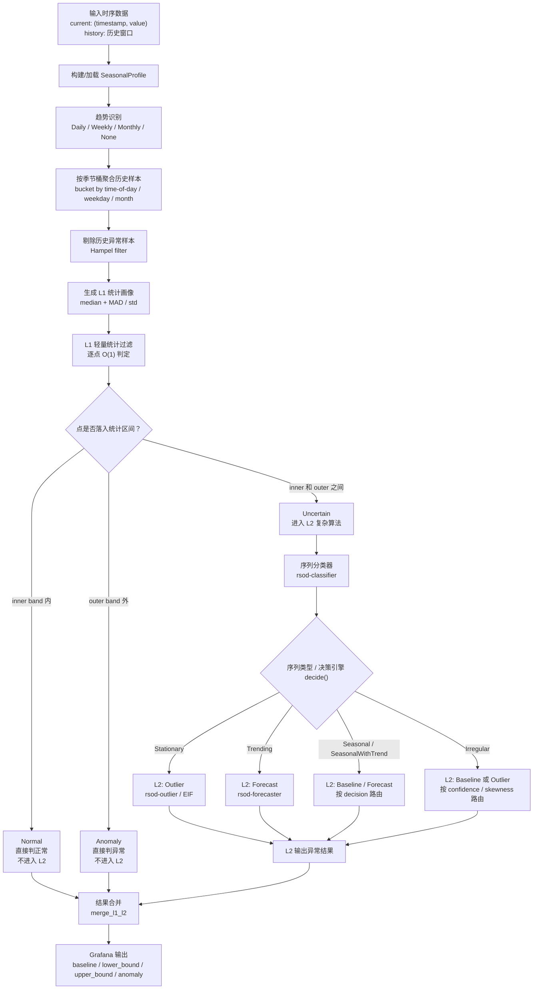
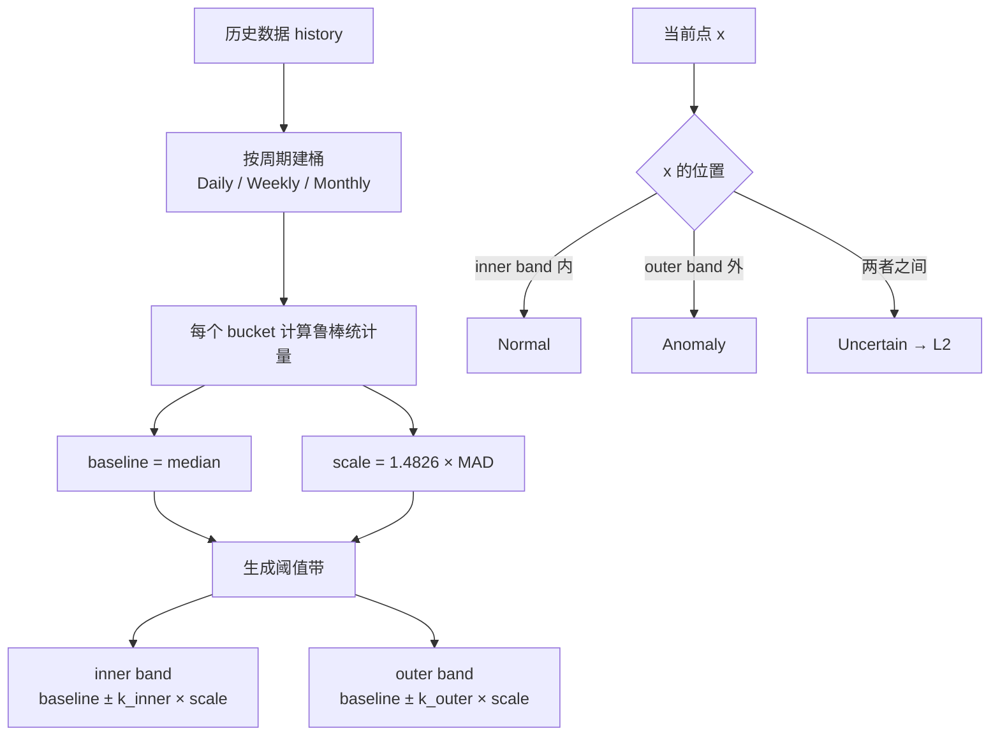
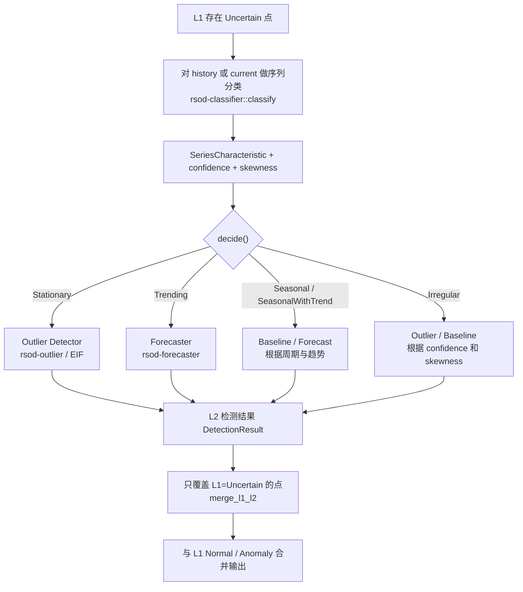
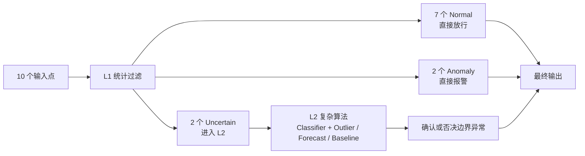

# Funnel 漏斗型时序异常检测算法

本文件描述 `rsod-funnel` 的整体流程与 L1 / L2 算法流程，用于说明一段时序数据在漏斗架构中的处理路径。

## 1. 设计目标

Funnel 采用漏斗型分层检测：

- **L1（统计预筛）**：偏统计的轻量算法，对绝大多数点做 O(1) 快速裁决，直接判定明显正常和明显异常的点。
- **L2（复杂算法）**：只对 L1 无法判定的灰区点（`Uncertain`）升级到较重的 ML 算法（Outlier / Forecast / Baseline）。

目标是让大部分正常数据在 L1 被过滤，只有少量不确定的点进入 L2，兼顾精度与成本。

对应实现：

- L1：[rsod/crates/rsod-funnel/src/l1.rs](../rsod/crates/rsod-funnel/src/l1.rs)
- Profile：[rsod/crates/rsod-funnel/src/profile.rs](../rsod/crates/rsod-funnel/src/profile.rs)
- Pipeline：[rsod/crates/rsod-funnel/src/pipeline.rs](../rsod/crates/rsod-funnel/src/pipeline.rs)
- L2 路由：[rsod/crates/rsod-funnel/src/l2.rs](../rsod/crates/rsod-funnel/src/l2.rs)
- 度量指标：[rsod/crates/rsod-funnel/src/metrics.rs](../rsod/crates/rsod-funnel/src/metrics.rs)

## 2. 整体流程图



## 3. L1 算法流程

L1 基于历史构建的季节画像，对当前每个点做 O(1) 三态判定，不做重训练。



L1 的三态判定语义（[FilterVerdict](../rsod/crates/rsod-funnel/src/l1.rs)）：

| 判定 | 条件 | 处理 |
| --- | --- | --- |
| `Normal` | 落在内带 `inner band` 内 | 直接判正常，不进入 L2 |
| `Anomaly` | 落在外带 `outer band` 外 | 直接判异常，不进入 L2 |
| `Uncertain` | 落在内带与外带之间 | 升级到 L2 复杂算法 |

阈值方法（MAD / IQR / ZScore）由历史数据的偏度自动选择。

## 4. L2 算法流程

L2 不是固定单一模型，而是先对序列分类，再由决策引擎路由到具体算法，且**只覆盖 L1 判为 `Uncertain` 的点**。



一句话概括：

> L1 用历史统计画像把明显正常和明显异常的点快速裁掉；只有落在灰区的 `Uncertain` 点才触发 L2。L2 先判断时序类型，再路由到 Outlier、Forecast 或 Baseline 算法，最后只覆盖这些灰区点的判定结果。
>
> 注意：L2 当前在 Grafana 面板路径中默认关闭（`enable_l2 = false`，见 [pkg/plugin/datasource.go](../pkg/plugin/datasource.go)），可在算法侧显式开启。

## 5. 一段时序经过 L1/L2 的示例

假设当前窗口有 10 个点：

| 点位 | 原始值 | L1 判定 | 是否进入 L2 | 最终结果 |
| --- | ---: | --- | --- | --- |
| t1 | 100 | Normal | 否 | 正常 |
| t2 | 102 | Normal | 否 | 正常 |
| t3 | 98 | Normal | 否 | 正常 |
| t4 | 135 | Uncertain | 是 | 由 L2 决定 |
| t5 | 160 | Anomaly | 否 | 异常 |
| t6 | 101 | Normal | 否 | 正常 |
| t7 | 129 | Uncertain | 是 | 由 L2 决定 |
| t8 | 99 | Normal | 否 | 正常 |
| t9 | 97 | Normal | 否 | 正常 |
| t10 | 180 | Anomaly | 否 | 异常 |

对应的漏斗分流：



## 6. 可度量的漏斗效果

`funnel_detect_with_metrics` 在检测的同时返回 [FunnelMetrics](../rsod/crates/rsod-funnel/src/metrics.rs)，用于量化漏斗分流：

| 指标 | 含义 |
| --- | --- |
| `total_points` | 当前 eval 窗口点数 |
| `l1_normal` / `l1_anomaly` / `l1_uncertain` | L1 三态分流数量 |
| `l1_coverage_rate` | L1 直接裁决比例 `(normal + anomaly) / total` |
| `l2_escalation_rate` | 升级到 L2 的比例 `uncertain / total` |
| `l2_enabled` / `l2_triggered` | L2 是否开启 / 本次是否触发 |
| `l2_method` | 本次 L2 实际路由到的算法 |
| `l1_elapsed_ms` / `l2_elapsed_ms` / `total_elapsed_ms` | 各阶段耗时 |

漏斗目标可表述为：`l1_coverage_rate` 尽量高（大部分点在 L1 裁决），`l2_escalation_rate` 保持在较低区间。

## 7. 可视化与基准

- 面板可视化示例：[rsod/crates/rsod-funnel/examples/funnel_viz.rs](../rsod/crates/rsod-funnel/examples/funnel_viz.rs)
- 指标基准（含 `L1_cov` / `L2_rate` / 耗时）：[rsod/crates/rsod-funnel/examples/funnel_bench.rs](../rsod/crates/rsod-funnel/examples/funnel_bench.rs)

运行方式：

```bash
cd rsod
cargo run --example funnel_viz -p rsod-funnel --release
cargo run --example funnel_bench -p rsod-funnel
```

可视化输出目录：`dataset/output/funnel_viz/`。
